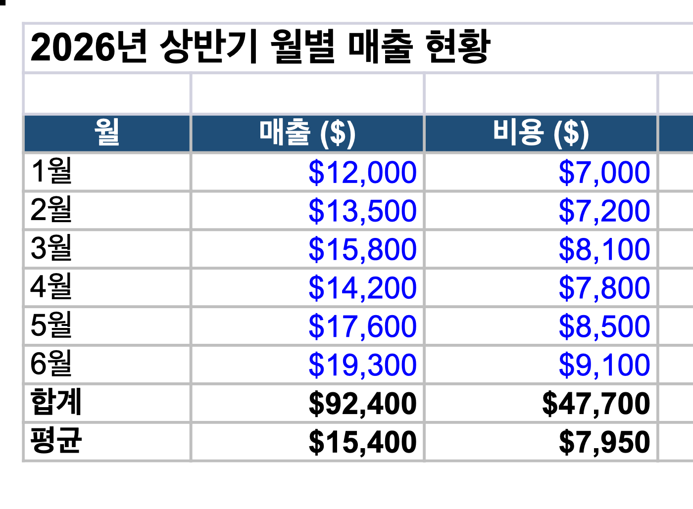
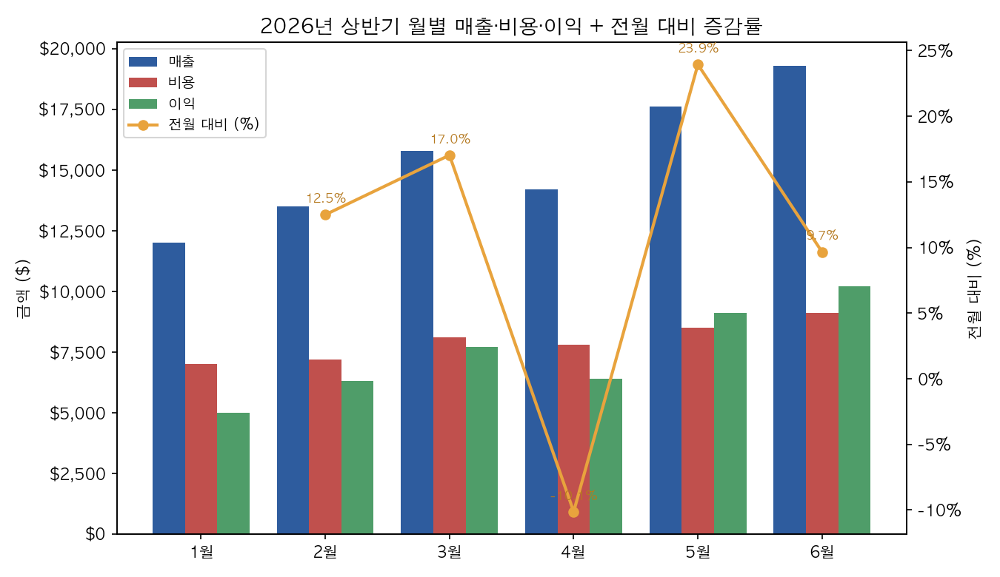

# 월별 매출현황 (Excel)

document-skills의 `xlsx` 스킬로 만든 샘플 엑셀 파일.

## 파일
- `월별매출현황.xlsx` — 2026년 상반기 월별 매출 현황 시트 (차트 포함)
- `command-input.txt` — 생성에 쓴 입력 명령
- `screenshot-table.png` — 표 미리보기
- `screenshot-chart.png` — 차트 렌더링

## 내용
2026년 상반기(1~6월) 월별 매출·비용·이익 표.

| 항목 | 설명 |
|------|------|
| 매출 ($) | 입력값 (파란색) |
| 비용 ($) | 입력값 (파란색) |
| 이익 ($) | `=매출-비용` 수식 |
| 전월 대비 (%) | `=(이번달-전달)/전달` 수식 |
| 합계 | `=SUM()` |
| 평균 | `=AVERAGE()` |

- 폰트: Arial, 통화/퍼센트 서식, 헤더 음영·테두리
- 색상 규칙: 파란색=입력값, 검정=수식
- 모든 수식 셀에 계산된 캐시값 주입 완료 (열기 전에도 값 표시)

## 차트
G3 위치 콤보 차트:
- 막대 — 월별 매출·비용·이익 (왼쪽 금액 축)
- 선 — 전월 대비 증감률 (오른쪽 % 축)

## 비고
이 환경에 LibreOffice가 없어 스킬의 자동 재계산(`recalc.py`) 대신 캐시값을 직접 주입함.
`screenshot-chart.png`는 xlsx 내 차트를 동일 데이터로 matplotlib 재현한 것 (모양·축·색 동일).
