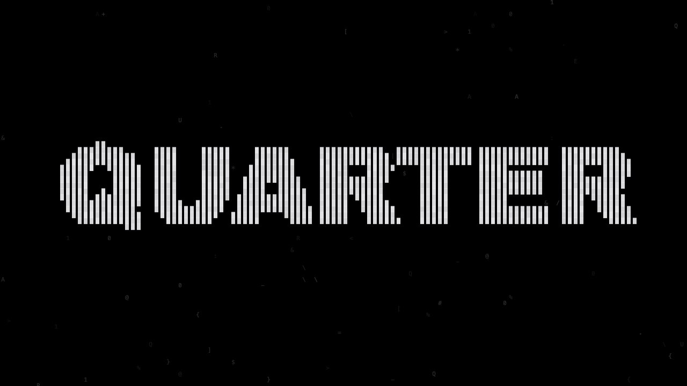
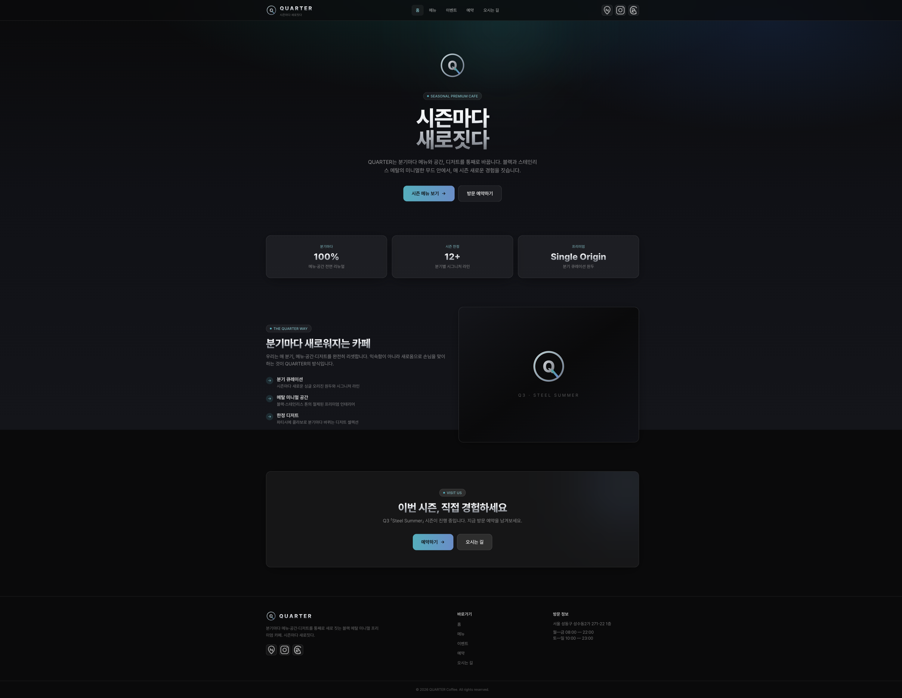
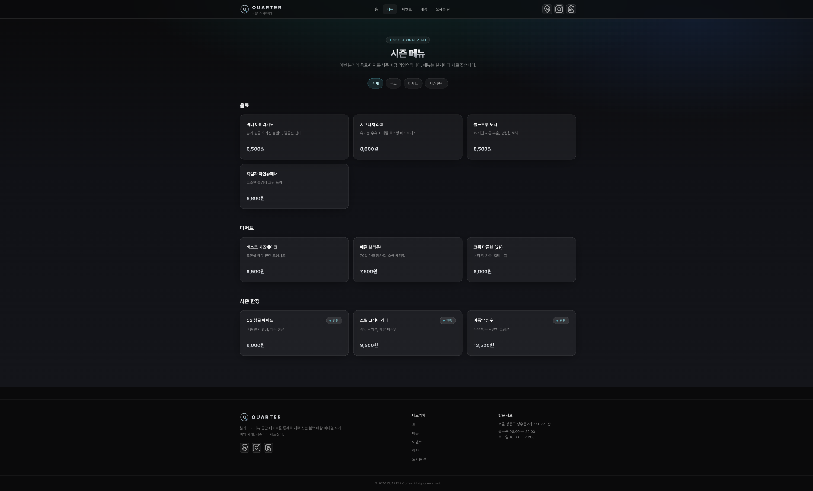
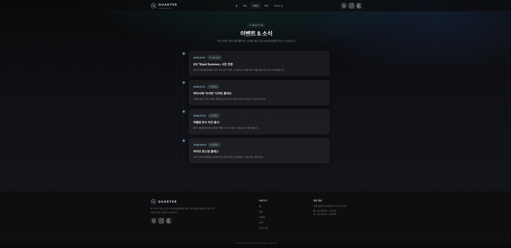
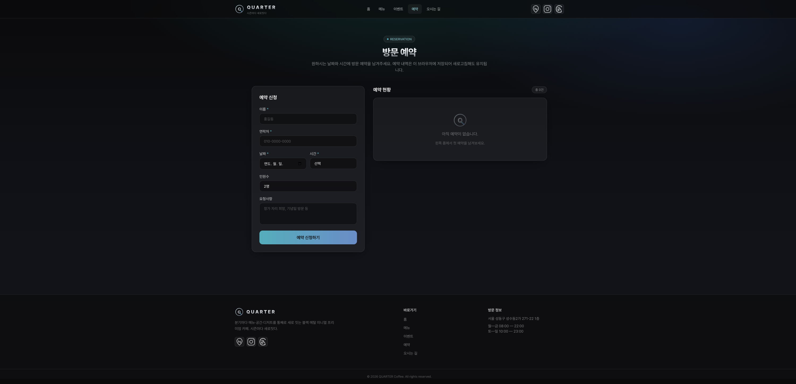
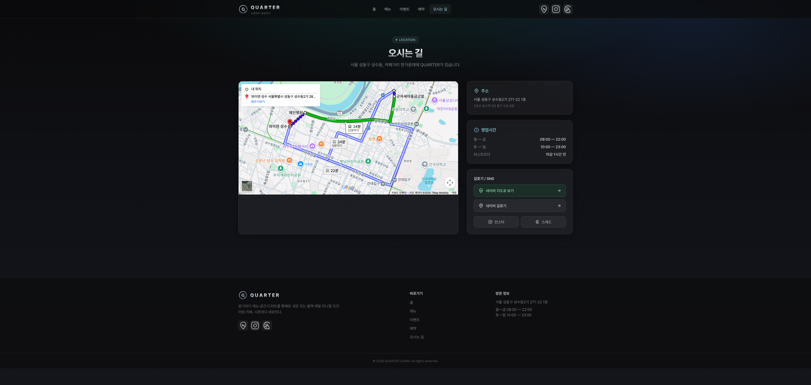

# QUARTER — 카페 웹사이트 (단일 index.html)

QUARTER 카페 컨셉(블랙·스테인리스 메탈 미니멀 프리미엄) 기반 공식 웹사이트 UI.
CDN 기반 **React 18 + ReactDOM + Babel(v7) + Tailwind**, 빌드 도구 없이 단일 `index.html`.

## 실행
```bash
cd 04_웹사이트
python3 -m http.server 8000
# → http://localhost:8000/
```
> 구글맵 embed·CDN 때문에 `file://`로 직접 열기보다 로컬 서버 권장.
> (`npx serve .` / VS Code Live Server 도 가능)

## 페이지 (해시 라우팅)
| 라우트 | 페이지 | 내용 |
|---|---|---|
| `#/` | 홈 | Q 메탈 링 로고·슬로건 "시즌마다 새로짓다", 라디얼 글로우 히어로, 소개·CTA |
| `#/menu` | 메뉴 | 음료/디저트/시즌 한정 필터 + 카드 그리드, 프리미엄 가격·한정 배지 |
| `#/event` | 이벤트 | 시즌 전환·콜라보·신메뉴 타임라인 카드 |
| `#/reserve` | 예약 | 예약 신청 폼 + 게시판(추가/삭제), **localStorage 저장**(새로고침 유지) |
| `#/location` | 오시는 길 | 성수동 구글맵 embed, 주소·영업시간, 네이버 지도/길찾기 버튼 |

## 기능
- **인트로 스플래시**: 로드 시 2초 ASCII/글리치 인트로로 QUARTER 워드마크가 응결 → 페이드아웃되며 홈 노출 (클릭 시 스킵). 독립 버전은 `../05_인트로`
- 예약 게시판: 이름·연락처·날짜·시간·인원·요청사항 → 게시판 등록 → localStorage 영속
- 외부 링크 아이콘(헤더+푸터): **네이버 지도 · 인스타그램 · 스레드** (인라인 SVG)
- 구글맵 iframe + 네이버 지도/길찾기 연결

## 디자인
- 다크 글래시 프리미엄: 글래스모피즘 카드, 시안/블루 액센트, 알약 라벨, 메탈 텍스트, 라디얼 글로우
- 블루/시안 액센트는 채도 50% 다운 (차분한 톤): Cyan #4B9E9E · Blue #6A8DC7
- 베이스 컬러: Black #0A0A0B · Ink #14151A · Steel #6C7077 · Chrome #E8EAED
- 한국어 웹폰트(Pretendard), 반응형

## 파일
- `index.html` — 앱 본체 (단일 파일, 인트로 포함)
- `command-input.txt` — 생성에 쓴 요구사항
- `screenshots/` — 미리보기 (intro·home·menu·event·reserve·location)

## 스크린샷

### 인트로 (2초 → 홈)


### 홈


### 메뉴


### 이벤트


### 예약


### 오시는 길

