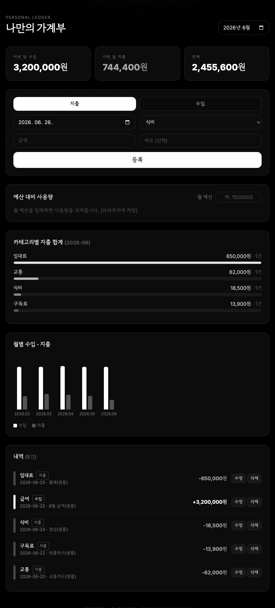

# 💰 나만의 가계부 (budget-app)

Server(Express) + DB(Supabase/PostgreSQL) 로 만든 수입·지출 가계부.
사용자가 내역을 등록하면 서버가 DB에 저장하고, 목록 조회와 **카테고리별·월별 합계(SQL GROUP BY)** 를 계산해 응답한다.



## 흐름

```
[사용자 입력 (날짜·금액·카테고리·메모·수입/지출)]
        → [Express Server: CRUD API]
        → [Supabase(PostgreSQL): entries 테이블에 저장]
        → 목록 조회 & GROUP BY 합계(카테고리별/월별) 계산
        → 결과 응답(JSON) → 화면 렌더(React)
```

- **DB 역할:** 수입/지출 내역 저장소 + 카테고리별/월별 통계 조회
- **Server 역할:** CRUD API 제공(등록·조회·수정·삭제) + 통계 집계

## 기능

1. 수입/지출 내역 **등록** (날짜, 금액, 카테고리, 메모, 수입/지출 구분)
2. 내역 **목록 조회** (월 필터)
3. **카테고리별 합계** (식비·교통·임대료·구독료·경조사 등, 막대 그래프)
4. 모든 데이터 **Supabase(PostgreSQL) 저장**
5. (보너스) **월별 수입·지출 차트**, **예산 대비 사용량** 표시

## 테이블 (entries)

| 컬럼 | 타입 | 설명 |
|---|---|---|
| `id` | BIGSERIAL PK | 식별자 |
| `type` | TEXT (`income`/`expense`) | 수입/지출 |
| `category` | TEXT | 식비, 교통, 임대료, 구독료, 경조사 등 |
| `amount` | NUMERIC(14,2) | 금액 |
| `memo` | TEXT | 메모 |
| `date` | DATE | 날짜 |
| `created_at` | TIMESTAMPTZ | 생성 시각 |

서버 첫 실행 시 `initDb()` 가 테이블을 자동 생성한다. (또는 `schema.sql` 을 Supabase SQL Editor 에 붙여넣어 실행)

## API

| 메서드 | 경로 | 설명 |
|---|---|---|
| GET | `/api/categories` | 카테고리 목록 |
| GET | `/api/entries?month=YYYY-MM&type=` | 내역 목록(필터 선택) |
| POST | `/api/entries` | 등록 |
| PUT | `/api/entries/:id` | 수정 |
| DELETE | `/api/entries/:id` | 삭제 |
| GET | `/api/summary/category?month=&type=` | 카테고리별 합계 (GROUP BY category) |
| GET | `/api/summary/monthly` | 월별 수입/지출 합계 (GROUP BY month) |
| GET | `/api/summary/totals?month=` | 총 수입·지출·잔액 |

카테고리별 합계 핵심 쿼리:

```sql
SELECT category, SUM(amount) AS total, COUNT(*) AS count
  FROM entries
 WHERE type = 'expense'
 GROUP BY category
 ORDER BY total DESC;
```

## 실행 방법

```bash
# 1) 의존성 설치
npm install

# 2) 환경변수 설정 (.env.example 참고)
cp .env.example .env
#   .env 의 DATABASE_URL 을 Supabase 연결 문자열로 채운다.
#   Supabase 대시보드 → Project Settings → Database → Connection string
#   → "Connection pooling"(포트 6543) 권장. (서버가 SSL 자동 적용)

# 3) 서버 실행
npm start          # 또는 npm run dev (파일 변경 자동 재시작)

# 4) 브라우저에서 http://localhost:3000 접속
```

> 로컬 PostgreSQL 로 테스트할 경우 `DATABASE_URL` 호스트가 `localhost`/`127.0.0.1` 이면 SSL 을 자동으로 끈다.

## 기술 스택

- **Server:** Node.js, Express (ESM)
- **DB:** Supabase(PostgreSQL), `pg`(node-postgres) 커넥션 풀
- **Front:** React 18 + Tailwind (CDN, 단일 `public/index.html`, `@babel/standalone` v7 고정)
- 차트는 외부 라이브러리 없이 CSS 막대로 구현

## 파일 구조

```
budget-app/
├── server.js          # Express + pg, CRUD API + GROUP BY 통계
├── schema.sql         # entries 테이블 DDL (참고용)
├── public/index.html  # React 프론트엔드 (단일 파일)
├── .env.example       # DATABASE_URL / PORT 예시
├── package.json
├── command-input.txt  # 이 앱을 만든 입력 명령
└── screenshots/01-overview.png
```

> 스크린샷은 실제 `public/index.html` 프론트엔드를 **샘플 데이터**로 렌더해 캡처한 UI 미리보기다.
> 실제 데이터는 본인 Supabase 에 연결(.env)하면 그대로 저장·조회된다.
