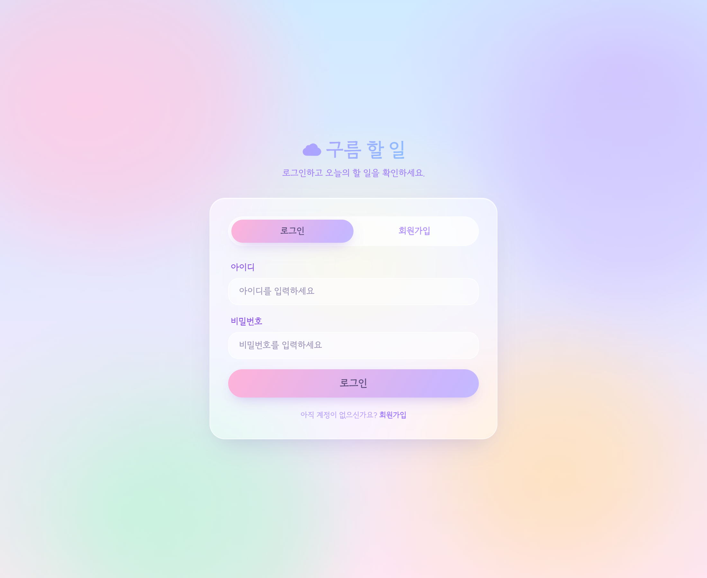
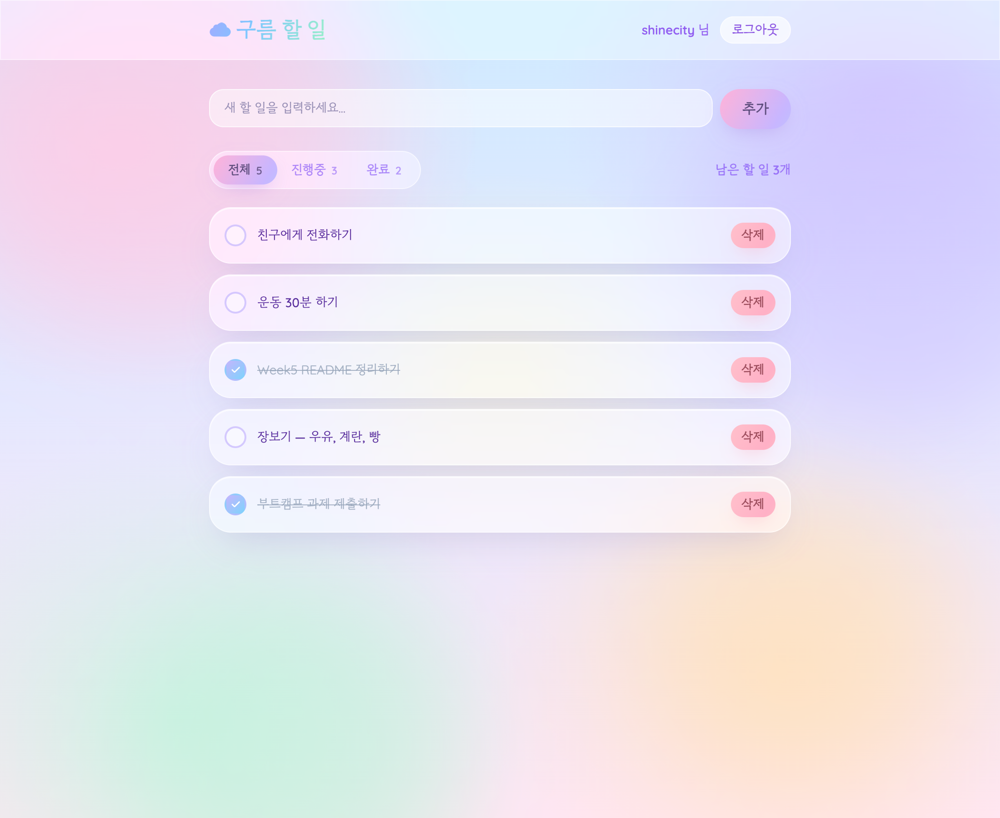

# 할 일 관리 앱 (Todos) — JWT 인증

PostgreSQL(Supabase) + Express + CDN React 로 만든, 사용자별 할 일 관리 앱입니다.
JWT 토큰 기반 회원가입/로그인을 거쳐야 하며, 각 사용자는 **자신의 할 일만** 보고 수정할 수 있습니다.

## 시연 화면

| 로그인 / 회원가입 | 할 일 목록 |
|:---:|:---:|
|  |  |

로그인하면 사용자 이름과 함께, 전체/진행중/완료 필터·남은 개수·완료 항목 취소선이 적용된 목록이 보입니다.

## 스택

- **백엔드**: Node.js (ESM) · Express 4 · `pg` (node-postgres) · `jsonwebtoken` · `bcryptjs`
- **프론트엔드**: 단일 `public/index.html` — CDN React 18 + Tailwind + `@babel/standalone@7` (빌드 도구 없음)
- **DB**: Supabase PostgreSQL (pooler, SSL 필수)

## 실행 방법

```bash
cd Week5/todos
npm install          # express, pg, dotenv, jsonwebtoken, bcryptjs
npm start            # 또는 npm run dev (파일 변경 시 자동 재시작)
```

서버가 뜨면 `users` / `todos` 테이블이 없으면 자동 생성됩니다.
브라우저에서 **http://localhost:3000** 접속 → 회원가입/로그인 → 할 일 관리.

## 환경 변수 (`.env`)

`.env.example` 참고. `.env` 는 `.gitignore` 처리되어 커밋되지 않습니다.

| 변수 | 설명 |
|------|------|
| `DATABASE_URL` | Supabase/PostgreSQL 연결 문자열 (SSL 적용됨) |
| `JWT_SECRET` | JWT 서명용 비밀키 (운영 시 반드시 변경) |
| `PORT` | 웹 서버 포트 (기본 3000) |

## 데이터베이스 스키마

```sql
users (id, username UNIQUE, password_hash, created_at)
todos (id, user_id FK→users ON DELETE CASCADE, text, done, created_at)
```

비밀번호는 bcrypt 해시로 저장되고, JWT 페이로드는 `{id, username}` (`expiresIn: 7d`) 입니다.

## API

인증 (토큰 불필요):

| 메서드 | 경로 | 본문 | 응답 |
|--------|------|------|------|
| POST | `/api/auth/register` | `{username, password}` | `{token, user}` · 중복 시 409 |
| POST | `/api/auth/login` | `{username, password}` | `{token, user}` · 실패 시 401 |

할 일 (모두 `Authorization: Bearer <token>` 필요):

| 메서드 | 경로 | 본문 | 응답 |
|--------|------|------|------|
| GET | `/api/todos` | — | 내 할 일 목록 (최신순) |
| POST | `/api/todos` | `{text}` | 생성된 할 일 |
| PUT | `/api/todos/:id` | `{text?, done?}` | 수정된 할 일 |
| DELETE | `/api/todos/:id` | — | `{ok:true, id}` |

> 모든 할 일 쿼리는 `WHERE user_id = ? AND id = ?` 로 **사용자 단위로 격리**되어,
> 다른 사용자의 할 일은 조회·수정·삭제할 수 없습니다. 토큰 없이/만료 시 401 을 반환하며
> 프론트엔드는 401 을 받으면 토큰을 지우고 로그인 화면으로 돌아갑니다.

## 검증 완료

회원가입 → 로그인 → 할 일 생성/완료 토글/삭제 → 새로고침 후 유지,
그리고 다른 사용자가 내 할 일을 볼 수 없음(격리)까지 Supabase 실 DB 대상으로 확인했습니다.
