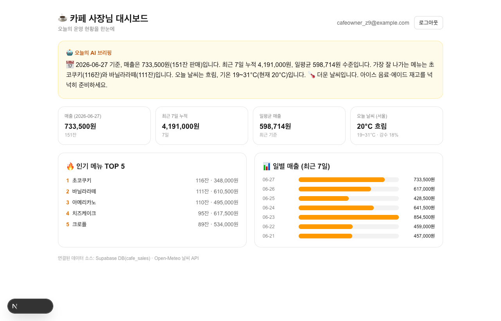
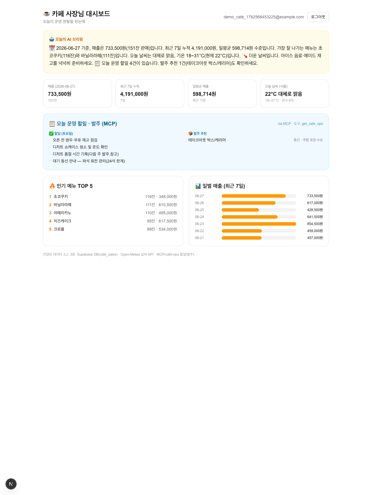
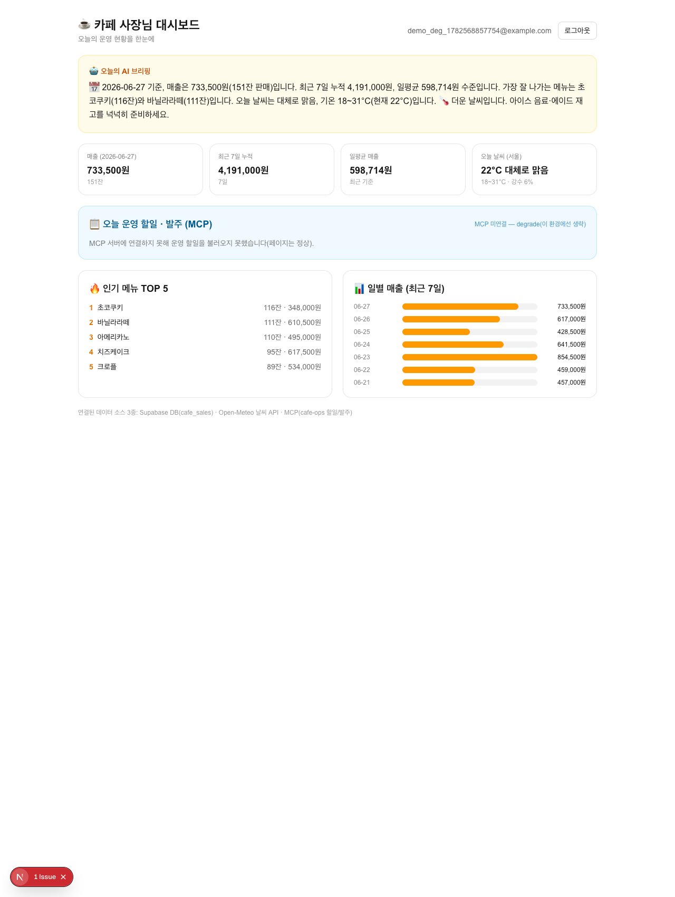

# ☕ 카페 사장님 대시보드 (보스 퀘스트)

> 🔗 **배포**: https://cafe-dashboard-45lp497pb-seongjinshinecitys-projects.vercel.app (Vercel, Production)
> ⚠️ Vercel **Deployment Protection(SSO)**이 켜져 있어 소유자만 접근됩니다. 외부 공개하려면 Settings → Deployment Protection → Vercel Authentication 을 **Disabled**로 변경하세요.

로그인한 사장님에게 **카페 운영 데이터를 한 화면**으로 보여주고, 데이터를 종합한 **AI 브리핑**을 생성하는 대시보드입니다.

- 스택: **Next.js 16 (App Router) + React 19 + TypeScript + Tailwind v4**
- 인증/DB: **Supabase Auth + Postgres**, 세션 `@supabase/ssr` + `src/proxy.ts`
- 출처 스펙: `../../specs/cafe-dashboard.spec.md`

## 연결된 데이터 소스 (3개 — Auth+**MCP**+DB+App)

| # | 소스 | 내용 | 키 |
| --- | --- | --- | --- |
| 1 | **Supabase DB** (`cafe_sales`) | 일자별 메뉴 판매(매출·수량) | anon 키 + 로그인 세션 |
| 2 | **Open-Meteo 날씨 API** | 서울 현재/오늘 기온·강수확률 | **불필요** |
| 3 | **MCP** (`cafe-ops` 서버) | 오늘 운영 할일·발주 추천(요일 기반) | **불필요**(stdio) |

### MCP 소스 상세 (가이드 제목의 `MCP` 충족)
- 가이드 [Auth+**MCP**+DB+App]의 "Notion MCP(할일/발주)" 자리를 **자체 MCP 서버**로 구현(외부 인증 불필요).
- 서버: `mcp-server/cafe-ops-server.mjs` — `@modelcontextprotocol/sdk` **stdio 서버**, 도구 `get_cafe_ops`.
- 클라이언트: `src/lib/mcp-ops.ts` — Next 서버 컴포넌트가 **MCP 클라이언트로 spawn → `listTools` → `callTool`** (진짜 프로토콜 라운드트립, SDK import만 한 가짜 아님).
- 라운드트립 증거 재현: `node mcp-server/_roundtrip_test.mjs` → `listTools=["get_cafe_ops"]` + `callTool` 결과 출력.
- 대시보드 위젯에 **`via MCP · 도구: get_cafe_ops`** 표기로 실제 경유를 노출. AI 브리핑에도 MCP 데이터(할일 건수·발주) 반영.
- 🛡️ **graceful degrade (실증됨)**: 연결 실패 시 `null` 반환 → MCP 위젯만 비활성, **페이지·기존 DB/날씨·브리핑은 그대로**. MCP 서버를 임시 제거하고 실제 렌더를 확인함 → `docs/screenshots/dashboard-mcp-degraded.png`("MCP 미연결 — degrade" 표기 + 나머지 위젯 정상). 로그: `[mcp-ops] MCP 연결 실패 → degrade`.
- ⚠️ **로컬/Node 런타임 전용**: Vercel **서버리스는 stdio 서브프로세스 spawn 불가**(read-only FS·npx 없음) → 배포 인스턴스에선 위 degrade가 자동 적용(위젯만 빠지고 앱은 정상). 로컬 `npm run dev`/`start`에서 MCP 작동을 검증함.
- 📌 **현재 라이브 Vercel 배포는 MCP 이전 코드**입니다(GitHub `main`엔 MCP 반영, 아직 재배포 안 함). 재배포(`vercel deploy --prod`)하면 위 degrade가 적용됩니다(MCP는 로컬에서만 작동).

## 기능 (위젯)

- 🤖 **AI 브리핑** — 매출·인기메뉴·날씨·**MCP 운영 할일/발주**를 종합한 자연어 브리핑(규칙기반, API 키 0). 실제 DB 숫자·날씨·MCP 데이터를 문장에 반영.
- 💰 **매출 요약** — 최신 영업일 매출/판매수, 최근 7일 누적, 일평균
- 🔥 **인기 메뉴 TOP 5** — 판매량 기준
- 🌤️ **날씨** — Open-Meteo 실데이터(실패 시 위젯만 degrade, 페이지는 유지)
- 📋 **오늘 운영 할일·발주 (MCP)** — `cafe-ops` MCP 서버에서 요일 기반 할일·발주 추천(실패 시 위젯만 degrade)
- 📊 **일별 매출** — 최근 7일 막대

> 매출 요약·브리핑은 하드코딩된 "어제"가 아니라 **데이터에 실제 존재하는 최신 날짜**를 기준으로 집계합니다(실행 시점과 무관하게 동작).

## 접근 제어
`/`(대시보드)는 **로그인(사장님)만** 접근 가능 — 비로그인은 `/login`으로 리다이렉트. `cafe_sales`는 RLS로 인증 사용자만 조회.
(단일 카페 데모라 사용자별 분리는 하지 않음 — 로그인한 사장님이 전체 매출을 봄.)

## 실행 방법
```bash
npm install
# .env.local: NEXT_PUBLIC_SUPABASE_URL, NEXT_PUBLIC_SUPABASE_ANON_KEY
npm run dev          # http://localhost:3000
npm run build && npm start
```
Supabase: autoconfirm 켜기 + `cafe_sales` 테이블/RLS 생성 + 샘플 매출 seed.

## DB 스키마 (`cafe_sales`)
```sql
create table public.cafe_sales (
  id uuid primary key default gen_random_uuid(),
  date date not null, menu_name text not null, category text,
  quantity int not null check (quantity>0), amount numeric not null check (amount>=0),
  created_at timestamptz default now());
alter table public.cafe_sales enable row level security;
create policy cafe_sales_select_auth on public.cafe_sales for select to authenticated using (true);
```

## 폴더 구조
```
src/
├─ proxy.ts                  # 세션 갱신
├─ app/
│  ├─ page.tsx               # 대시보드(로그인 보호) — 위젯 + 브리핑
│  ├─ login/page.tsx
│  └─ actions.ts             # 인증 서버 액션
└─ lib/
   ├─ supabase/*             # SSR 클라이언트
   ├─ weather.ts             # Open-Meteo fetch (no-store, 실패 안전)
   └─ cafe.ts                # 집계(summarize) + 규칙기반 브리핑(buildBriefing)
```

## 스크린샷






