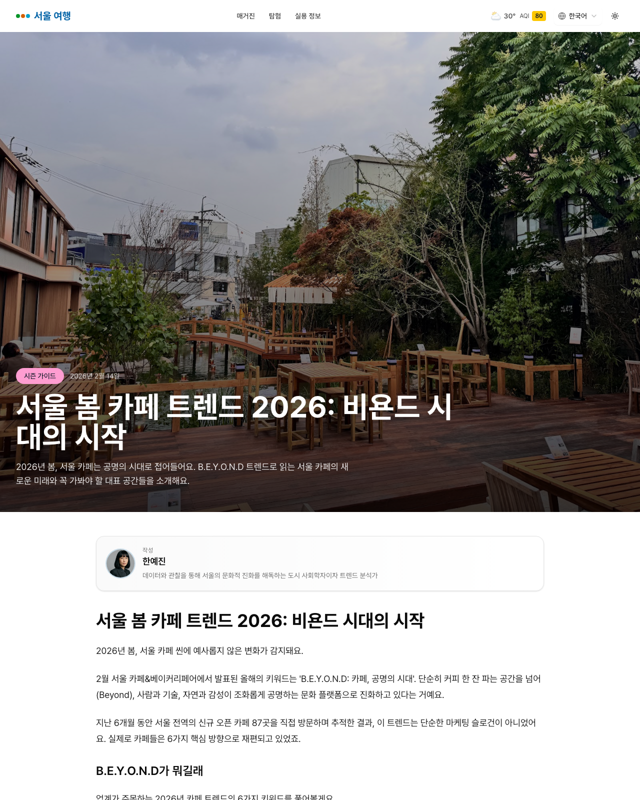
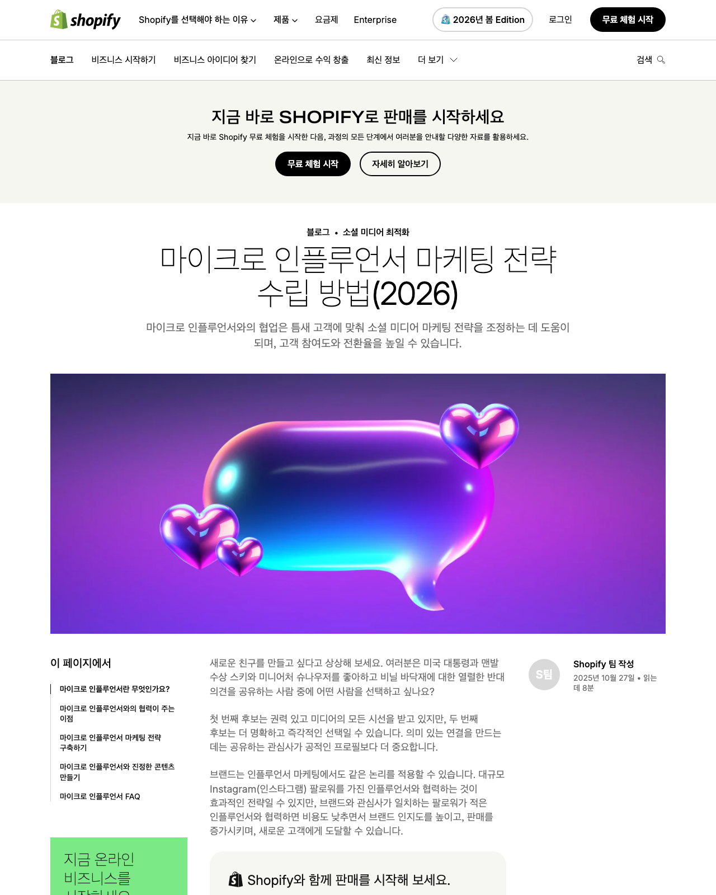
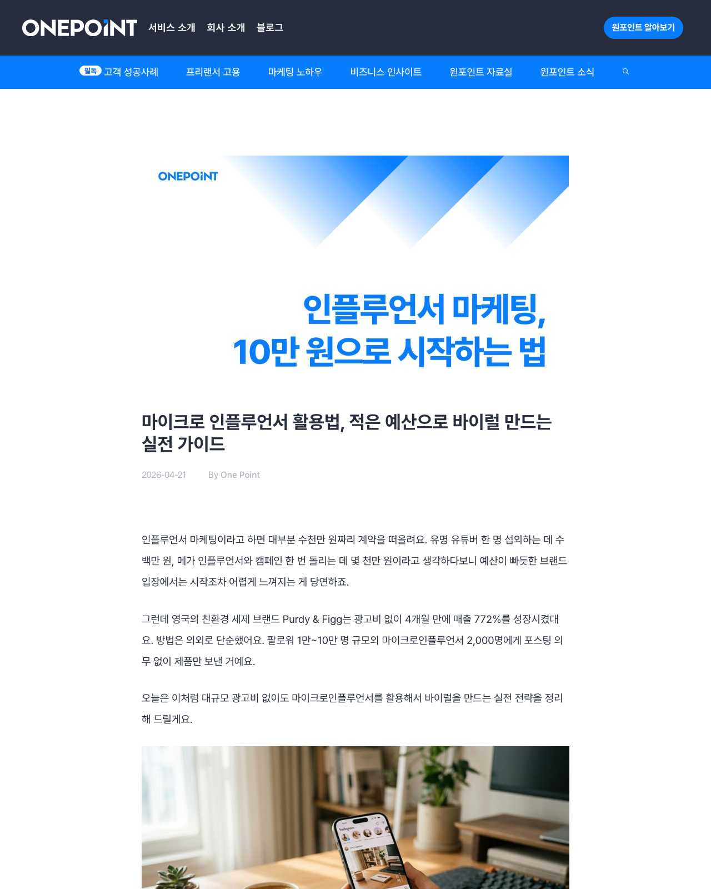

# 🔎 자동 리서치 스킬 (프로젝트 7)

"리서치 해줘 / 조사해줘 / 트렌드 정리해줘" 류의 요청이 오면 **매번 같은 절차·같은 포맷**으로 웹 조사를 수행하는 **재사용 스킬**입니다. 일회성 답변이 아니라 `.claude/skills/research/SKILL.md`로 박제해, 어느 대화에서든 동일하게 재현됩니다.

## 무엇이 핵심인가
- **박제**: 절차(검색→3곳+ 수집→고정 포맷 정리→공유)가 SKILL.md에 들어 있어 사람이 매번 지시하지 않아도 동일하게 동작.
- **재현성**: 주제가 바뀌어도 결과물 구조가 같아 바로 보고서로 사용 가능.
- **사실성**: 추정이 아니라 실제 `WebSearch`/`WebFetch`로 확인한 사실(숫자·고유명사)만 기록 + 출처 링크.

## 스킬 절차 (SKILL.md)
1. **주제 확정** — 요청에서 키워드 추출
2. **수집** — `WebSearch`로 검색, 서로 다른 출처 **3곳 이상**, 깊이 필요 시 `WebFetch`로 본문 심화
3. **정리** — 고정 템플릿으로 `.md` 작성(아래), 출처는 마크다운 링크
4. **공유(보너스)** — Notion MCP 있으면 페이지화, **없으면 건너뛰고 파일 저장**(없는 연결을 지어내지 않음)

### 고정 출력 포맷
```
# 리서치: <주제>
- 수집일 / 키워드 / 출처 수
## 출처별 핵심   (출처 → 확인한 사실)
## 한 줄 요약
## 다음 액션
```

## 검증 (이 프로젝트의 변별 기준)

### 1) 메커니즘 — WebSearch/WebFetch 실제 동작 ✅
headless 환경에서 Browser MCP보다 안정적인 `WebSearch`/`WebFetch`를 선택. 실제 결과·URL 반환 확인.

### 2) 트리거 + 재현성 — **실제 재호출 2회** ✅
손으로 예시를 지어내지 않고, **별도의 `claude -p` 프로세스**를 이 폴더에서 실행해 자연어 요청만으로 스킬이 발동하는지 확인:

| 재호출 | 요청(자연어) | 결과 |
| --- | --- | --- |
| 1 | "성수동 경쟁 카페의 최신 트렌드를 리서치 해줘" | research 스킬 발동 → 출처 5곳 → 동일 포맷 `.md` 저장. Notion 미연결이라 **파일 저장 규칙까지 그대로 따름** |
| 2 | "2026년 직장인 재테크 트렌드 알아봐줘"(카페와 무관) | research 스킬 발동 → 동일 포맷 `.md` (주제 무관 포맷 일관성 증명) |

- 재호출 로그: `out/_reinvoke1_run.txt`, `out/_reinvoke2_run.txt`
- 재호출이 생성한 결과: `out/성수동-경쟁카페-트렌드-2026-06-27.md` 등
- 내가 절차대로 직접 수집한 결과 2개: `out/research_seongsu-cafe-trend.md`, `out/research_cafe-instagram-marketing.md`

> 네 개 모두 섹션 구조(제목/메타/출처별 핵심/한 줄 요약/다음 액션)가 동일 → **재현성 확인**.

## 사용법
```bash
# 이 폴더(.claude/skills/research 가 보이는 위치)에서 Claude Code 실행 후:
"성수동 경쟁 카페 트렌드 리서치 해줘"
"채용 시장 트렌드 조사해줘"   # 주제 무엇이든 같은 포맷
```

### 3) 자동 탐색 스크린샷 (제출물) ✅
리서치에 실제 인용한 출처 페이지를 headless Chrome으로 캡처:








> 식신·trip.com 등 일부는 CloudFront 봇 차단(403)이라 정상 렌더된 출처만 남겼습니다(차단 페이지는 제출하지 않음).

## 솔직한 한계
- **Notion MCP 미연결** → 4단계(공유)는 `.md` 파일 저장으로 대체. 연결되면 자동으로 페이지화하도록 SKILL.md에 분기.
- API 키 불필요(WebSearch/WebFetch는 키 없이 동작).

## 폴더 구조
```
build/research-skill/
├─ .claude/skills/research/SKILL.md   # 스킬 박제(언제+절차+포맷)
└─ out/
   ├─ research_seongsu-cafe-trend.md        # 직접 수집 결과 1
   ├─ research_cafe-instagram-marketing.md  # 직접 수집 결과 2
   ├─ 성수동-경쟁카페-트렌드-*.md            # 재호출1 산출
   ├─ _reinvoke1_run.txt / _reinvoke2_run.txt  # 재호출 로그
```
