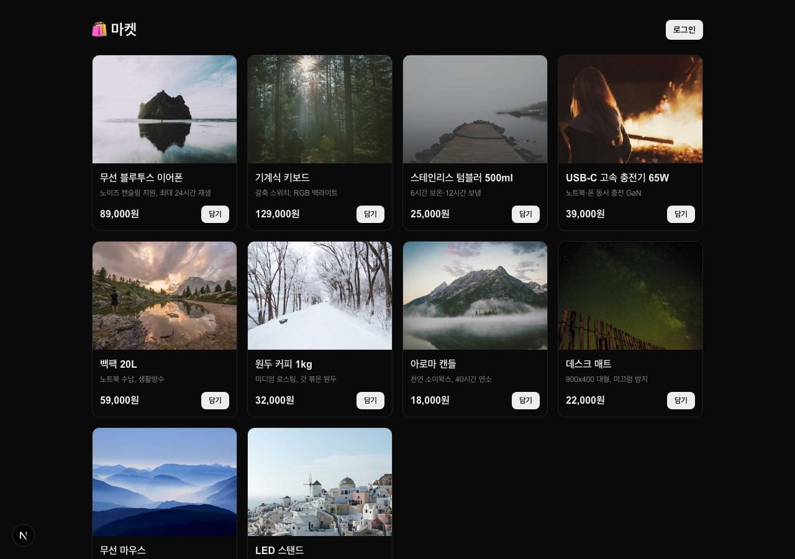
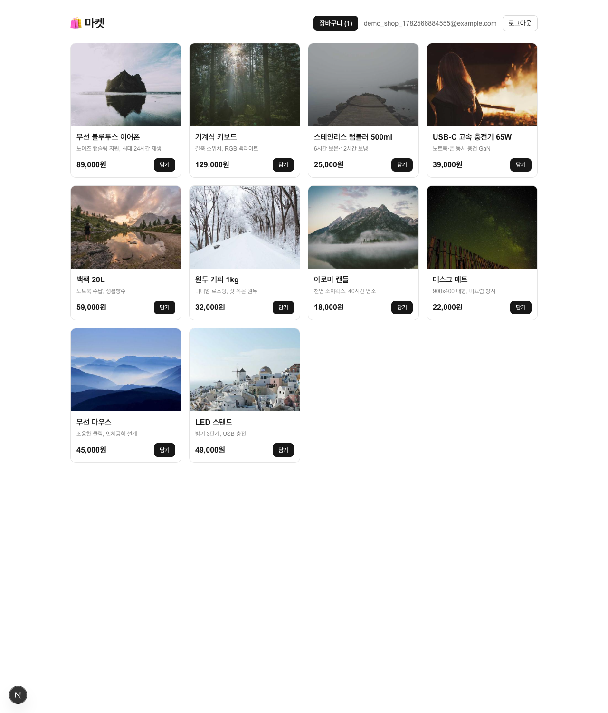
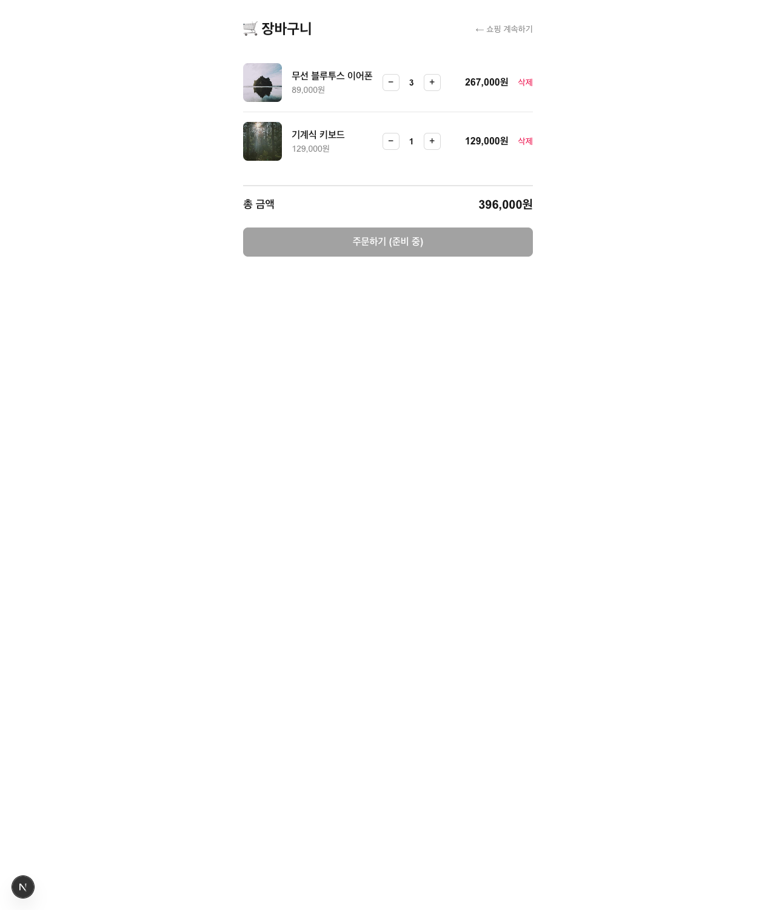

# 🛍️ 쇼핑몰 (Auth + DB, 결제 제외)

> 🔗 **배포**: https://shopping-mall-qudpb6fx0-seongjinshinecitys-projects.vercel.app (Vercel, Production)
> ⚠️ Vercel **Deployment Protection(SSO)**이 켜져 있어 소유자만 접근됩니다. 외부 공개하려면 Settings → Deployment Protection → Vercel Authentication 을 **Disabled**로 변경하세요.

상품 목록(공개) → 장바구니 담기(로그인) → 수량 변경·삭제·합계까지. **결제는 제외**("주문하기"는 준비 중).
장바구니 권한은 **Supabase RLS**가 DB 레벨에서 강제합니다.

- 스택: **Next.js 16 (App Router) + React 19 + TypeScript + Tailwind v4**
- 인증/DB: **Supabase Auth(이메일+비밀번호) + Postgres**, 세션 `@supabase/ssr` + `src/proxy.ts`
- 출처 스펙: `../../specs/shopping-mall.spec.md`

## 기능

| 기능 | 권한 |
| --- | --- |
| 상품 목록(이름·가격·이미지·설명) | **공개** |
| 장바구니 담기 (같은 상품은 수량 +1) | 로그인 사용자만 |
| 장바구니 조회·수량(+/-)·삭제·합계 | **작성자 본인만** |
| 주문하기 | 결제 제외 → "준비 중"(비활성) |

## 보안 설계
`service_role` 키 **미사용.** 모든 `cart` 접근은 anon 키 + 로그인 세션(JWT)을 통하며 RLS가 강제한다.

| 테이블 | RLS |
| --- | --- |
| `products` | SELECT 공개. 쓰기 정책 없음(seed는 관리 API). |
| `cart` | SELECT/INSERT/UPDATE/DELETE 모두 `user_id = auth.uid()`(본인만). `unique(user_id, product_id)`. |

## 실행 방법
```bash
npm install
# .env.local 에 NEXT_PUBLIC_SUPABASE_URL, NEXT_PUBLIC_SUPABASE_ANON_KEY 설정
npm run dev          # http://localhost:3000
npm run build && npm start
```

### Supabase 설정
1. 이메일 자동확인(autoconfirm) 켜기 (SMTP 없으면 로그인 막힘).
2. `products`/`cart` 테이블 + RLS 정책 생성, 샘플 상품 seed.

## DB 스키마
```sql
create table public.products (
  id uuid primary key default gen_random_uuid(),
  name text not null, price numeric not null check (price>=0),
  image_url text, description text, created_at timestamptz default now());
alter table public.products enable row level security;
create policy products_select_all on public.products for select using (true);

create table public.cart (
  id uuid primary key default gen_random_uuid(),
  user_id uuid not null default auth.uid() references auth.users(id) on delete cascade,
  product_id uuid not null references public.products(id) on delete cascade,
  quantity int not null default 1 check (quantity>0),
  created_at timestamptz default now(), unique(user_id, product_id));
alter table public.cart enable row level security;
create policy cart_select_own on public.cart for select to authenticated using (user_id=auth.uid());
create policy cart_insert_own on public.cart for insert to authenticated with check (user_id=auth.uid());
create policy cart_update_own on public.cart for update to authenticated using (user_id=auth.uid()) with check (user_id=auth.uid());
create policy cart_delete_own on public.cart for delete to authenticated using (user_id=auth.uid());
```

## 폴더 구조
```
src/
├─ proxy.ts                       # 세션 갱신
├─ app/
│  ├─ page.tsx                    # 상품 목록(공개) + 담기
│  ├─ cart/page.tsx               # 장바구니: 수량/삭제/합계/주문하기(준비중)
│  ├─ login/page.tsx
│  └─ actions.ts                  # 인증 + 장바구니 서버 액션
└─ lib/{supabase/*, types.ts}
```

## 스크린샷






